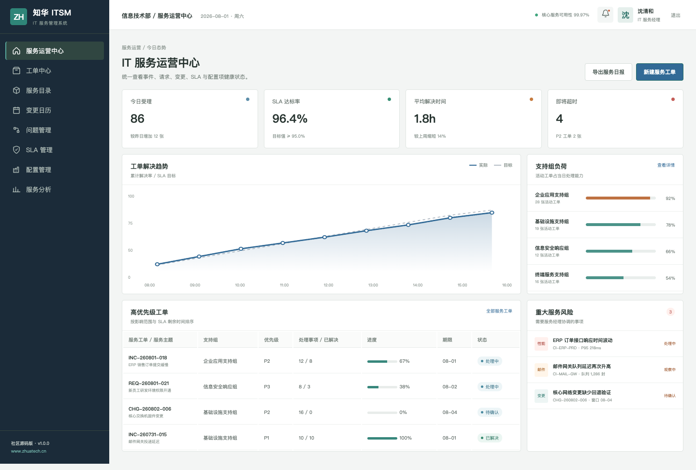
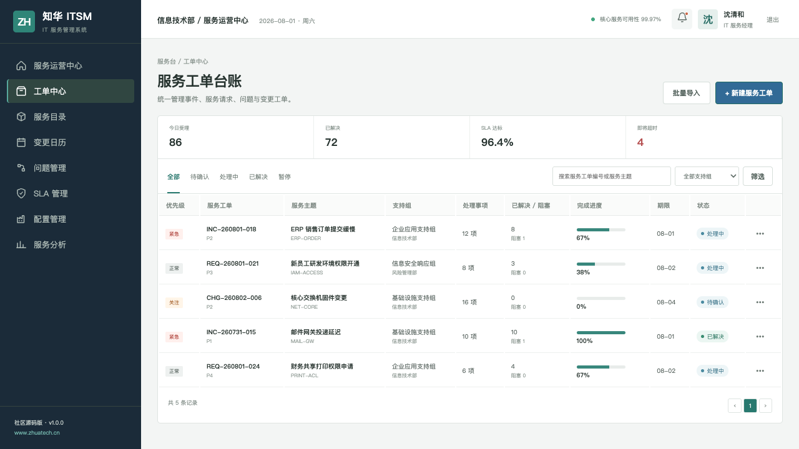
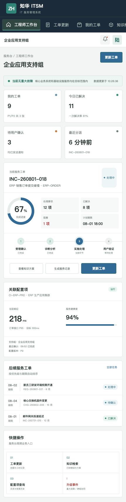

# ZhuaTech ITSM 社区源码版

面向企业 IT 服务台和运维团队的事件、请求、问题、变更、SLA 与配置管理系统。

**发布方：知华科技（上海如静知华信息科技有限公司）** · [官方网站 https://www.zhuatech.cn/](https://www.zhuatech.cn/)

---

## 服务运营应该回答的四个问题

1. 当前有哪些业务服务受到影响？
2. 哪些工单即将违反 SLA？
3. 事件背后关联了哪些配置项和变更？
4. 同类问题是否已有可靠知识方案？

ZhuaTech ITSM 用统一工单时间线连接用户、支持组、服务、配置项、知识与服务目标。

## 页面与说明



运营中心展示今日受理、SLA 达标、平均解决时间、支持组负荷和重大服务风险，帮助服务经理先处理影响业务的事项。



工单中心覆盖事件、服务请求、问题和变更，按优先级、支持组、配置项、解决进度与 SLA 期限管理。



响应式工程师端提供工单更新、知识检索、配置项关系、服务记录和重大事件升级。

## 已包含模块

- 服务运营驾驶舱与工单队列
- 事件、请求、问题、变更基础模型
- 服务目录与支持组
- SLA 状态和违约风险
- CMDB 配置项及健康状态
- 知识检索与工程师工作台
- JWT 登录、角色权限、统一异常响应
- MySQL/Flyway、H2 测试、Docker Compose

## 技术信息

```text
Backend : Java 21 / Spring Boot / Security / JPA
Frontend: Vue 3 / Pinia / Vue Router / Axios / Vite
Database: MySQL 8
Package : cn.zhuatech.itsm
```

## 快速预览

```bash
cd frontend
npm install
npm run dev:demo
```

访问 `http://localhost:5173`：

- IT 服务经理：`planner / Demo@2026`
- 服务台工程师：`operator / Demo@2026`

完整部署执行 `cp .env.example .env`，配置安全密码和 `JWT_SECRET` 后运行 `docker compose up --build`。

## 新增：IT 变更风险评审

新增 `POST /api/admin/change-risk`，根据影响服务和用户规模、回退演练、备份、监控、变更窗口、近期失败以及紧急属性计算风险，自动输出 `STANDARD`、`CAB_REQUIRED` 或 `REJECT` 决策及上线前控制项。

## 从社区版走向企业生产

可继续加入 SSO、LDAP/AD、邮件与企微机器人、自动分派、值班表、监控告警接入、远程协助、CMDB 自动发现、服务成本、满意度、知识推荐和 ITIL 流程审计。

## 重要许可说明

本工程仅供个人进行非商业学习、研究与技术交流，**不得商用**。企业内部使用、生产部署、托管服务、客户实施、二次开发交付、收费咨询或培训均需上海如静知华信息科技有限公司书面授权，详见 [LICENSE](LICENSE)。

深度定制、系统集成、生产部署及商业授权，请访问[知华科技官网](https://www.zhuatech.cn/)或扫描二维码咨询：

| 微信一 | 微信二 |
| --- | --- |
|  |  |

SEO 关键词：ITSM 开源源码、IT 服务管理系统、服务台、工单系统、SLA 管理、CMDB、事件管理、Java ITSM、Vue ITSM、知华科技。

## SLA 违约预测

新增 `POST /api/itsm/insights/sla-breach-forecast`，综合已耗时、剩余工作量、支持组排队深度和优先级预测解决时间，返回 SLA 缓冲、风险分与 `ON_TRACK / AT_RISK / BREACH_LIKELY`。高风险工单会自动给出转派、协同处理和客户沟通建议。
